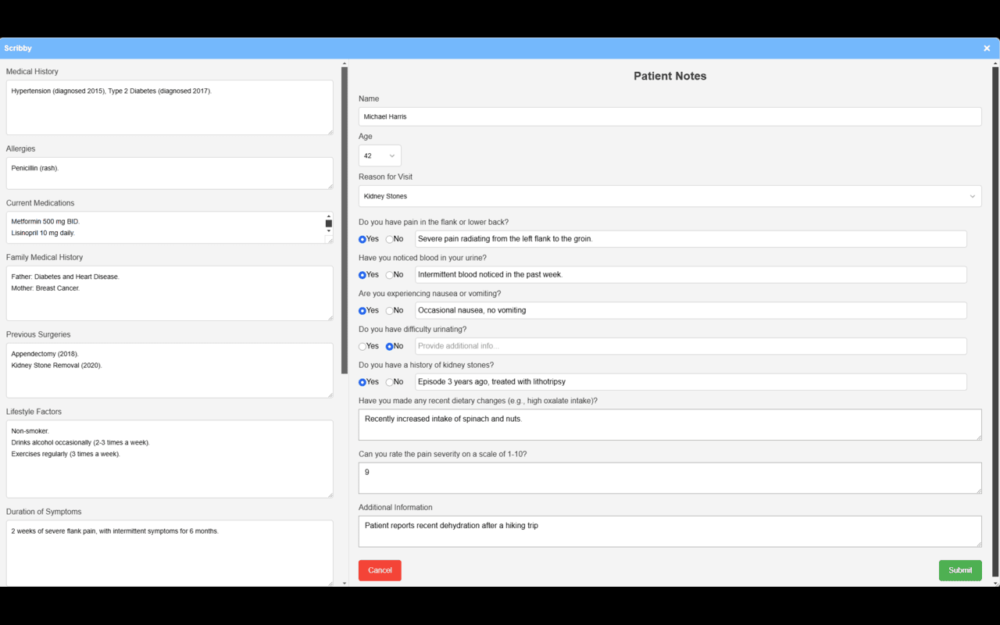
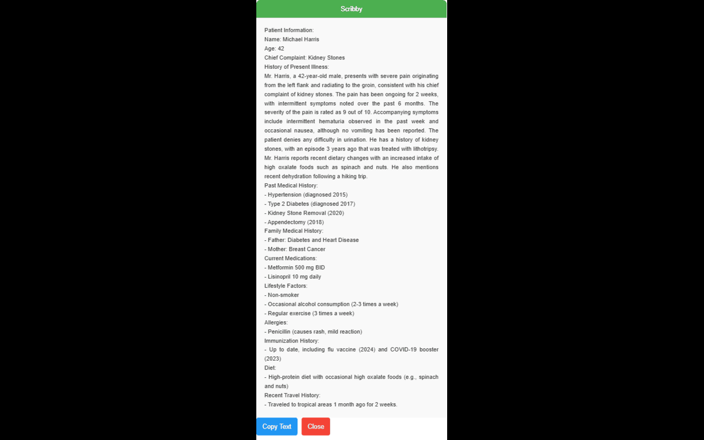

# Scribby

**Scribby** is a specialized Google Chrome extension designed to save medical professionals, particularly urologists, valuable time by automating the generation of patient notes. Whether you're reviewing patient histories, summarizing consultations, or preparing detailed notes, Scribby integrates seamlessly into your workflow, ensuring accuracy and efficiency.

---

## Features

- **AI-Powered Note Generation**: Highlight key points from patient data or consultations to instantly generate structured notes.
- **Custom Templates**: Create and utilize templates tailored to urology, such as post-operative summaries, diagnosis documentation, and follow-up recommendations.
- **Streamlined Workflow**: Minimize manual input and maximize time spent on patient care with intuitive tools.
- **Secure API Integration**: Safeguard patient data while leveraging cutting-edge AI tools through secure API connections.
- **Customizable Options**: Adjust settings and templates to align with your practice's specific needs.

---

## Installation

1. **Download Scribby**
   - Clone this repository or download it as a ZIP file.
   - Extract the contents to a local folder.

2. **Load as Unpacked Extension**
   - Open Google Chrome and navigate to `chrome://extensions`.
   - Enable **Developer mode** (toggle in the upper-right corner).
   - Click **Load unpacked** and select the extracted Scribby folder.

3. **Set Your API Key**
   - Open the extension and navigate to the settings page.
   - Enter your secure API key to activate advanced features.

---

## Usage

1. Highlight relevant text from electronic medical records (EMRs), consultation notes, or diagnostic findings.
2. Right-click and select a note type (e.g., "Follow-Up Summary," "Diagnostic Notes").
3. Review and edit the AI-generated note directly in the extension or copy it to your EMR system.

---

## Files and Structure

- **`background.js`**: Handles the extension's background processes.
- **`manifest.json`**: Core configuration file for Chrome.
- **`set-api-key.html/js`**: Interface for managing API keys.
- **Assets**: Icons (`icon16.png`, `icon48.png`, `icon128.png`) and sample files (e.g., `ding.mp3`, `ex1.png`).

---

## Screenshots

### Inputting Patient Data

### AI-Generated Patient Note

---

## Contributing

We welcome contributions from developers and medical professionals! To contribute:

1. Fork the repository.
2. Create a new branch for your feature or bugfix.
3. Commit your changes and submit a pull request.
4. Ensure your code follows the project's guidelines.

---

## License

This project is licensed under the MIT License. See the LICENSE file for more details.

---

## Feedback and Support

For feedback, suggestions, or issues, please open an issue on GitHub or contact us directly.

---

**Revolutionize your note-taking process with Scribby!**

